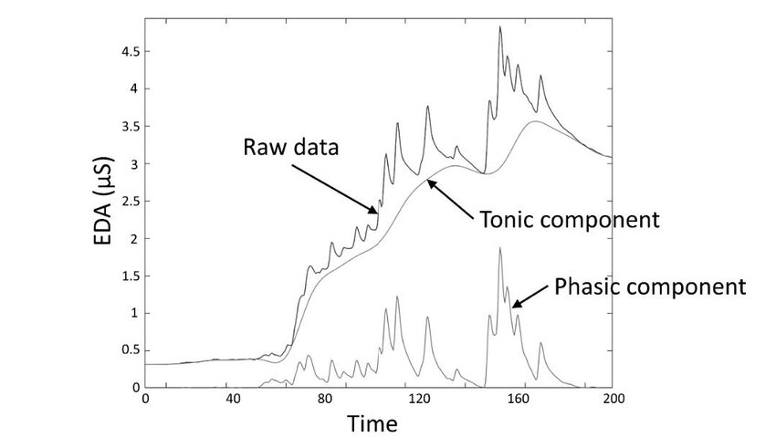
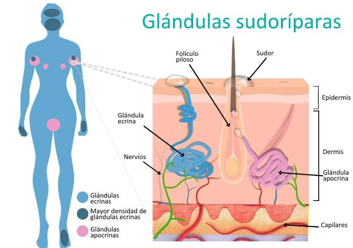
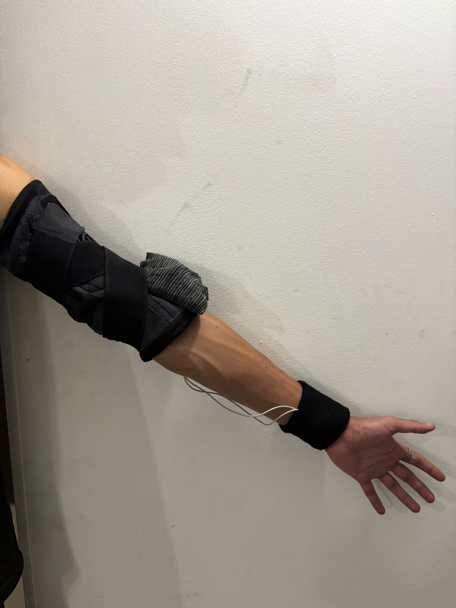
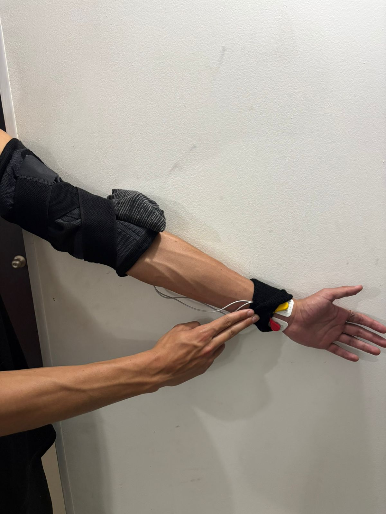
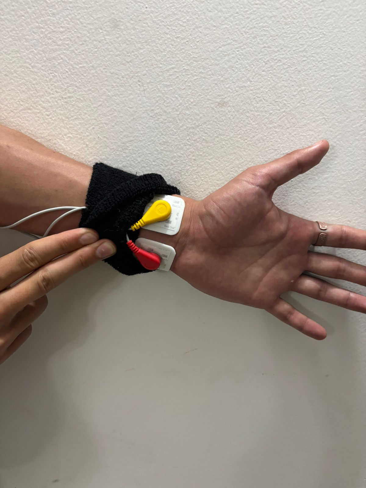
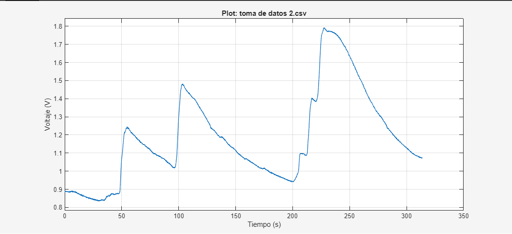

# Laboratorio_Respuesta_Galbanica

## Actividad Electrodermica

La actividad electrodermica (AED/EDA) y la respuesta galvanica cutanea (GSR) se refieren a cambios en las propiedades electricas de la piel causados por la actividad de las glandulas sudoriparas bajo control del sistema simpatico. Son esencialmente el mismo fenomeno medido y nombrado de formas ligeramente distintas. 

  

  <em>Figura 1. Forma de onda típica de la señal EDA.</em>

---

## Conceptos Basicos 

### Actividad electrodérmica (EDA)

Es cualquier fenomeno electrico observable en la piel, normalmente medido como conductancia cutanea (cuanta corriente pasa) o resistencia cutanea (cuanto se opone) [3][8][10].  
Estos cmabios se deben a la sudoracion: mas sudos (agua con sales) ---> Mayor conductancia, menor resistencia [3][19].

---

### Respuesta Galvanica Cutanea (GSR)

Es el nombre clasico para las variaciones rapidas y trasnsitorias de la EDA ante estimulos emocionales o cognitivos (sonidos, imagenes, pensamientos, estres, miedo, atencion) [1][2][5][10].

Suele Descomponerse en:

- Nivel de conductancia cutánea (SCL): componente tónico, de fondo, más lento [2][18].
- Respuestas de conductancia cutánea (SCR): picos rápidos ligados a estímulos concretos [2][10][20].

---

## Base fisiológica y qué indica

La EDA/GSR refleja la inervación simpática de las glándulas sudoríparas ecrinas, especialmente en palmas y plantas, muy sensibles a estímulos psicológicos más que térmicos [3][10][20].

Es un índice objetivo de activación del sistema nervioso autónomo y de arousal emocional o cognitivo (estrés, atención, ansiedad, carga mental) [1][2][8][12][18].

  

  <em>Figura 2. Glándulas Sudoríparas.</em>

Usos Principales
 | Uso                    | Qué se mide                     | Aplicaciones                                                              | Citaciones        |
|:-----------------------|:--------------------------------|:--------------------------------------------------------------------------|:------------------|
| Estrés y emoción       | Cambios en SCL y SCR            | Psico/Neurofisiología, comunicación, "lie detector"                      | [1][3][5][18][19] |
| Trastornos mentales    | Patrones de EDA                 | Psiquiatría, neurorehabilitación, GSR-biofeedback                         | [2][12]           |
| Biofeedback terapéutico| Control voluntario de la respuesta | Epilepsia, ansiedad, entrenamiento emocional                              | [1][7][2]         |

  <em>Figura 3. Usos Principales para la señal EDA/GSR</em>

# Zonas del cuerpo con glándulas sudoríparas útiles para conductancia cutánea

El cuerpo tiene glándulas ecrinas prácticamente en toda la piel, con mayor densidad en palmas, plantas, frente y dedos.

## Distribución de glándulas y sudor

Las glándulas ecrinas están en casi todo el tegumento; se concentran sobre todo en palmas y plantas, con densidades muy altas también en la frente.

Las regiones sin glándulas sudoríparas son pocas: borde rojo de los labios, conducto auditivo externo, lecho ungueal, glande, clítoris y labios menores.

En términos de tasa de sudoración durante calor o ejercicio, las zonas más activas son: espalda (central y baja), frente, dedos dorsales y parte alta de la espalda; las menos activas son: brazos, muslos y parte baja de las piernas.

---

## Opciones prácticas para el laboratorio de EDA

Estudios que comparan ubicaciones para conductancia cutánea muestran:

| Zona                          | Utilidad para EDA emocional            | Comentarios                                                   |
|-------------------------------|----------------------------------------|---------------------------------------------------------------|
| Dedos / palmas                | Muy alta (estándar oro)                | Máxima densidad de glándulas y alta reactividad fisiológica  |
| Plantas / pies (dedos, arco)  | Muy buena alternativa                  | Respuesta similar o incluso superior a los dedos              |
| Muñeca                        | Aceptable si manos/pies no disponibles | Menor amplitud de señal, pero funcional                      |
| Hombros                       | Buena para emoción                     | Mejor que brazo o espalda, aunque menos práctico para cables |
| Frente                        | Poco fiable                            | Alta tasa de sudor, pero baja correlación con EDA emocional  |
| Espalda / pecho               | Baja reactividad                       | No recomendadas como sustituto de dedos                      |

  <em>Figura 4. Comparación de localizaciones para medir EDA.</em>

---

## Recomendaciones concretas

- Si no es posible usar los dedos, los pies (dedos o arco plantar) representan la mejor alternativa para registrar respuestas emocionales.
- Si los pies tampoco pueden utilizarse, la muñeca es una opción aceptable, considerando que la señal tendrá menor amplitud.

---

## Conclusión

Aunque casi toda la piel posee glándulas sudoríparas, para la medición de conductancia cutánea asociada a respuestas emocionales las zonas más adecuadas son dedos y palmas. Como alternativa viable se encuentran los pies. La frente presenta producción de sudor significativa, pero no ofrece una señal de EDA tan consistente ni confiable como manos o pies.

# Efectos de la corriente eléctrica en el ser humano según IEC 60479 (ítems 1-5)

La norma IEC 60479-1 describe cómo la intensidad, tipo de corriente (CC/CA), frecuencia, trayectoria a través del cuerpo y duración determinan el daño: desde sensación apenas perceptible hasta fibrilación ventricular y muerte 3697.

---

## Factores generales (aplica a CA y CC)

- El riesgo se relaciona con la corriente que atraviesa el cuerpo, no solo con el voltaje; esta depende de la impedancia corporal (piel, tejidos, humedad, área de contacto) [23][26][27].  
- Corrientes que cruzan el tórax y el corazón (por ejemplo, mano-mano, mano-pies) tienen mucha mayor probabilidad de producir fibrilación ventricular (FV) que trayectorias solo entre pies [26][27].  
- IEC 60479-1 usa curvas corriente-tiempo para delimitar zonas de: no percepción, percepción, tetania/dificultad para soltar y riesgo de FV [23][26][27].

---

## Corriente alterna (CA, 15–100 Hz, p.ej. 50/60 Hz de red)

Las curvas de IEC 60479-1 para CA de baja frecuencia muestran que [23][26][29]:

| Rango de corriente (mano-mano, adulto) | Efectos típicos | Citaciones |
|----------------------------------------|-----------------|------------|
| ~0,5–1 mA | Umbral de percepción (hormigueo) | [23][22][26] |
| 5–10 mA | Dolor notable; comienzo de contracción muscular | [23][22][26][29] |
| 10–30 mA | Tetania; posible imposibilidad de “soltar” el conductor | [23][26] |
| 30–50 mA | Dificultad respiratoria; riesgo creciente para el corazón | [23][26][29] |
| ≥50–100 mA (≈100 ms o más) | Alto riesgo de fibrilación ventricular y muerte | [23][26][28] |

  <em>Figura 5. Rangos típicos de corrientes y efectos en CA 50/60 Hz</em>

- La probabilidad de FV aumenta con la corriente y con la duración del choque; IEC 60479-1 define factores de “corriente de corazón” (heart current factors) para distintos recorridos [26].  
- La CA de 50/60 Hz es especialmente peligrosa para el corazón (más eficaz en inducir FV que otras frecuencias) [23][26][29].

---

## Corriente continua (CC, DC)

IEC 60479 también da límites para CC, pero la respuesta fisiológica difiere [23][37][26]:

- El umbral de percepción puede ser algo mayor que en CA; la contracción muscular sostenida es frecuente, pero la tendencia a FV es diferente [23][26].  
- Por encima de unos pocos decenas de mA de CC pueden aparecer quemaduras, contracciones musculares dolorosas, parálisis respiratoria y, a intensidades elevadas, paro cardiaco (por FV o asistolia) [23][27].  
- Estudios de lesiones por CC muestran quemaduras y lesiones neurológicas importantes incluso cuando la FV no es el principal desenlace [37].  
- Modelos basados en IEC 60479 se usan para estimar la impedancia del cuerpo en choques CC y CA y así definir dispositivos de protección (disyuntores diferenciales, detectores de corriente de fuga, etc.) [23][31].

---

## Resumen conceptual de los ítems 1-5 de IEC 60479-1

Basados en la literatura que cita directamente IEC 60479-1 [23][26][29][27]:

- **Aspectos generales:** define modelos de impedancia del cuerpo y factores que influyen (tensión de contacto, humedad, área y trayectoria de contacto, frecuencia).  
- **Curvas de corriente-tiempo:** zonas sin efecto, con efectos reversibles, y con probabilidad creciente de FV.  
- **Corriente de corazón (heart current factors):** coeficientes que ajustan la corriente medida a la fracción que realmente atraviesa el corazón según la trayectoria [26].  
- **Diferencias CA/CC y con la frecuencia:** la CA 15–100 Hz tiene máxima eficacia fibrilante; CC y frecuencias altas se tratan con límites específicos [23][26][28][29].  
- **Aplicación a seguridad:** la norma sirve de base para calcular tensiones de contacto seguras, tiempos máximos de desconexión y diseño de sistemas de puesta a tierra y protección [23][27][31].

---

Estos elementos permiten evaluar sistemáticamente el riesgo de choques en instalaciones eléctricas y definir medidas de protección para personas.

# Cálculo de la corriente que circula a través del sujeto

## Fórmula general del cálculo

La corriente que circula a través del sujeto está dada por:

<b>I = (VCC − VEE) / (68 kΩ + Rskin)</b>

Donde:

- (VCC − VEE) es el voltaje de alimentación.
- 68 kΩ es la resistencia fija de protección en serie.
- Rskin es la resistencia de la piel del sujeto.
- I es la corriente que circulará a través del cuerpo.

En nuestro laboratorio se utilizará una fuente de **6 V DC**.

---

# A. Caso extremo: Rskin = 0 Ω

Se analiza la condición más crítica posible:

<b>I = 6 V / 68,000 Ω</b>

<b>I = 8.82 × 10-5 A</b>

<b>I = 0.088 mA</b>

### Resultado

Incluso en el peor escenario (cortocircuito en la piel), la corriente máxima es:

<b>Imax = 0.088 mA</b>

Este valor es **muy inferior a 1 mA**, que es el límite establecido.

---

# B. Caso real: Resistencia de piel en la frente

Los electrodos serán colocados en la frente.

La literatura de bioinstrumentación reporta que la resistencia piel-electrodo en zonas como la frente puede variar típicamente entre 10 kΩ y 100 kΩ, dependiendo de hidratación, presión de contacto y uso de gel conductor (Webster; Grimnes & Martinsen; IEC 60479-1).

Para un escenario conservador se asume:

<b>Rskin = 20 kΩ</b>

Entonces:

<b>I = 6 V / (68,000 Ω + 20,000 Ω)</b>

<b>I = 6 / 88,000</b>

<b>I = 6.82 × 10-5 A</b>

<b>I = 0.068 mA</b>

---

# ¿Por qué es seguro?

Según IEC 60479-1:

- El umbral de percepción en corriente continua está alrededor de 1 mA.
- Corrientes menores a 0.5 mA generalmente no son perceptibles.
- El riesgo de fibrilación ventricular ocurre en corrientes mucho mayores (decenas de mA atravesando el tórax).

En nuestro diseño:

- Corriente máxima absoluta: 0.088 mA  
- Corriente real estimada: 0.068 mA  

Estos valores son:

- Más de 10 veces menores que 1 mA.
- Muy inferiores al umbral de percepción.
- Extremadamente alejados de niveles peligrosos definidos por IEC 60479-1.

Por lo tanto, el sistema es eléctricamente seguro bajo las condiciones establecidas.
# MONTAJE 

<em>Figura 6. Montaje General.</em>

  

  <em>Figura 7. Montaje Electrodos.</em>

  

  <em>Figura 8. Montaje Electrodos 2.</em>

# CODIGO

<table>
<tr>
<td width="40%">

<em>Figura 9. Montaje General.</em>

</td>

<td width="60%">

### Descripción
> En esta sección del código se realiza la configuración inicial del sistema de adquisición de la señal de conductancia cutánea (GSR). Primero se limpian las variables, la consola y las figuras abiertas en MATLAB para asegurar una ejecución sin conflictos. Posteriormente se definen los parámetros de comunicación serial, incluyendo el puerto y la velocidad de transmisión, así como el nombre del archivo donde se almacenarán los datos adquiridos. También se establecen los parámetros de visualización de la gráfica en tiempo real, como la ventana temporal mostrada y el intervalo de actualización. Finalmente, se crea el archivo en formato CSV donde se guardarán las mediciones de tiempo, voltaje y nivel fisiológico detectado, escribiendo además la cabecera de las columnas. El sistema muestra en consola mensajes informativos indicando el inicio del proceso y el archivo donde se almacenarán los datos.
</td>
</tr>
</table>

<table>
<tr>
<td width="40%">

<em>Figura 9. Montaje General.</em>

</td>

<td width="60%">

### Descripción
> En esta sección del código se establece la comunicación serial entre MATLAB y el sistema embebido encargado de adquirir la señal GSR, configurando el puerto y la velocidad de transmisión previamente definidos. Se limpia el búfer de comunicación para evitar datos residuales y se ajusta el tiempo máximo de espera para la recepción de información. Posteriormente, se envía un comando al dispositivo para iniciar el proceso de calibración, el cual incluye una fase inicial de reposo seguida de una fase de respiración controlada, permitiendo determinar condiciones de referencia para la señal. Finalmente, se configura la interfaz gráfica donde se visualizarán los datos en tiempo real, definiendo los ejes, el título de la gráfica y los límites de visualización del voltaje y del intervalo de tiempo mostrado.
</td>
</tr>
</table>

<table>
<tr>
<td width="40%">

<em>Figura 9. Montaje General.</em>

</td>

<td width="60%">

### Descripción
> En esta sección del código se definen las variables de control necesarias para gestionar la adquisición y visualización de los datos. Se inicializan variables para almacenar el tiempo inicial de referencia, el último nivel fisiológico detectado y el control de actualización de la gráfica. Además, se crean buffers para almacenar temporalmente los valores de tiempo y voltaje que serán utilizados en la visualización de la señal. Posteriormente, se inicia el bucle principal del programa, el cual se ejecuta mientras la ventana de la gráfica permanezca abierta. Dentro de este bucle se verifica la disponibilidad de datos en el puerto serial; si no hay datos disponibles se realiza una breve pausa para evitar consumo innecesario de recursos. Cuando se reciben datos, estos se leen desde el puerto serial, se convierten a texto y se separan en líneas individuales para su posterior procesamiento.

</td>
</tr>
</table>

<table>
<tr>
<td width="40%">

<em>Figura 9. Montaje General.</em>

</td>

<td width="60%">

### Descripción
> En esta sección del código se procesan las líneas de información recibidas desde el sistema embebido a través de la comunicación serial. Primero se identifican posibles mensajes del sistema relacionados con el estado del proceso, como el inicio de la calibración, el cálculo de umbrales o la indicación de que el sistema está listo para comenzar la adquisición de datos, mostrando estos eventos en la consola para informar al usuario. Posteriormente, cuando la línea recibida corresponde a datos numéricos, esta se divide en sus diferentes componentes utilizando la coma como separador. A partir de estos valores se extraen el tiempo en milisegundos, el voltaje medido y el nivel fisiológico detectado. Además, se verifica la validez de los datos para evitar valores incorrectos y se establece un tiempo inicial de referencia que permite convertir los tiempos registrados a segundos relativos, facilitando su posterior visualización y análisis.
</td>
</tr>
</table>

<table>
<tr>
<td width="40%">

<em>Figura 9. Montaje General.</em>

</td>

<td width="60%">

### Descripción
> En esta sección del código se procesan las líneas de información recibidas desde el sistema embebido a través de la comunicación serial. Primero se identifican posibles mensajes del sistema relacionados con el estado del proceso, como el inicio de la calibración, el cálculo de umbrales o la indicación de que el sistema está listo para comenzar la adquisición de datos, mostrando estos eventos en la consola para informar al usuario. Posteriormente, cuando la línea recibida corresponde a datos numéricos, esta se divide en sus diferentes componentes utilizando la coma como separador. A partir de estos valores se extraen el tiempo en milisegundos, el voltaje medido y el nivel fisiológico detectado. Además, se verifica la validez de los datos para evitar valores incorrectos y se establece un tiempo inicial de referencia que permite convertir los tiempos registrados a segundos relativos, facilitando su posterior visualización y análisis.
</td>
</tr>
</table>

# TOMA DE DATOS

  

  <em>Figura . Adquisición de la señal.</em>

# Preguntas de Discusión
- **¿A qué se debe que una inspiración profunda incremente la magnitud de la respuesta galvánica cutánea (GSR)?:**
Una inspiración profunda provoca un aumento transitorio de la conductancia cutánea. Fisiológicamente, la maniobra altera las presiones intratorácicas y la dinámica ventricular, produciendo una descarga refleja simpática vía barorreceptores, y además interactúa con acoplamientos respiratorios centrales que amplifican la salida simpática sudomotora. El resultado es una mayor secreción por glándulas ecrinas (controladas por fibras simpáticas colinérgicas) y un incremento observable de la GSR con latencia característica de ~1–3 s y pico entre 2–5 s. Componentes atencionales y emocionales asociados a la respiración voluntaria pueden modular aún más esta respuesta
- **¿Cuáles serían las ventajas y desventajas de utilizar la GSR como indicador de estrés?:**
La GSR es un marcador sensible y con alta resolución temporal de la activación simpática aguda, útil para detectar cambios de arousal inducidos por estímulos o tareas. Sin embargo, su baja especificidad frente a distintas fuentes de activación (emocionales, térmicas, motoras), la variabilidad individual y la susceptibilidad a artefactos y condiciones ambientales limitan su uso como único indicador de ‘estrés’. Recomendamos emplearla junto con otras medidas autonómicas, endocrinas y autoinforme para una inferencia válida sobre el estrés.
                             
 # BIBLIOGRAFIA
- [1] Pop-Jordanova, N., & Pop-Jordanov, J. (2020). Electrodermal Activity and Stress Assessment. PRILOZI, 41, 5 - 15. https://doi.org/10.2478/prilozi-2020-0028.
- [2] Markiewicz, R., Markiewicz-Gospodarek, A., & Dobrowolska, B. (2022). Galvanic Skin Response Features in Psychiatry and Mental Disorders: A Narrative Review. International Journal of Environmental Research and Public Health, 19. https://doi.org/10.3390/ijerph192013428.
- [3] Posada-Quintero, H., & Chon, K. (2020). Innovations in Electrodermal Activity Data Collection and Signal Processing: A Systematic Review. Sensors (Basel, Switzerland), 20. https://doi.org/10.3390/s20020479.
- [4] Lin, Y., Chou, L., Tsai, K., & Liao, Y. (2025). A 96 dB Input Dynamic Range Galvanic Skin Response Readout IC With 3.5 pArms Input-Referred Noise for Mental Stress Monitoring. IEEE Transactions on Biomedical Circuits and Systems, 19, 897-907. https://doi.org/10.1109/tbcas.2025.3573614.
- [5] Lagopoulos, J. (2007). Electrodermal activity. Acta Neuropsychiatrica, 19, 316 - 317. https://doi.org/10.1111/j.1601-5215.2007.00247.x.
- [6] Zhu, X., Song, J., Liu, T., Huang, S., & Yao, B. (2024). Electrodermal activity and its molecular mechanisms: Unraveling insights into skin diseases. The Innovation Life. https://doi.org/10.59717/j.xinn-life.2024.100085.
- [7] Nagai, Y., Jones, C., & Sen, A. (2019). Galvanic Skin Response (GSR)/Electrodermal/Skin Conductance Biofeedback on Epilepsy: A Systematic Review and Meta-Analysis. Frontiers in Neurology, 10. https://doi.org/10.3389/fneur.2019.00377.
- [8] Amin, M., & Faghih, R. (2022). Physiological characterization of electrodermal activity enables scalable near real-time autonomic nervous system activation inference. PLoS Computational Biology, 18. https://doi.org/10.1371/journal.pcbi.1010275.
- [9] Hernando-Gallego, F., Luengo, D., & Artés-Rodríguez, A. (2018). Feature Extraction of Galvanic Skin Responses by Nonnegative Sparse Deconvolution. IEEE Journal of Biomedical and Health Informatics, 22, 1385-1394. https://doi.org/10.1109/jbhi.2017.2780252. 
- [10] Subramanian, S., Barbieri, R., & Brown, E. (2020). Point process temporal structure characterizes electrodermal activity. Proceedings of the National Academy of Sciences of the United States of America, 117, 26422 - 26428. https://doi.org/10.1073/pnas.2004403117. 
- [11] Nawawi, N., Sudirman, R., & Sheikh, U. (2023). Drowsiness Detection using Galvanic Skin Response and Electro-occulograph. Journal of Physics: Conference Series, 2622. https://doi.org/10.1088/1742-6596/2622/1/012004.
- [12] Critchley, H. (2002). Electrodermal responses: what happens in the brain.. The Neuroscientist : a review journal bringing neurobiology, neurology and psychiatry, 8 2, 132-42 .
- [13] Bruschi, V., Dourou, N., Iadarola, G., Poli, A., Spinsante, S., & Cecchi, S. (2023). Skin Conductance Under Acoustic Stimulation: Analysis by a Portable Device. , 62-78. https://doi.org/10.1007/978-3-031-28663-6_6.
- [14] Dawson, M., Schell, A., & Filion, D. (2007). The electrodermal system. , 159-181. https://doi.org/10.1017/cbo9780511546396.007.
- [15] Chen, F., Zhou, J., Wang, Y., Yu, K., Arshad, S., Khawaji, A., & Conway, D. (2016). Galvanic Skin Response-Based Measures. , 87-99. https://doi.org/10.1007/978-3-319-31700-7_5.
- [16] Boucsein, W. (2011). Electrodermal activity, 2nd ed.. . https://doi.org/10.1007/978-1-4614-1126-0.
- [17] Park, S., Park, J., Park, H., Park, H., & Song, J. (2018). Flexible galvanic skin response sensor based on vertically aligned silver nanowires. Sensors and Actuators B: Chemical. https://doi.org/10.1016/j.snb.2018.06.125.
- [18] Bailey, R. (2017). Electrodermal Activity (EDA). Encyclopedia of Personality and Individual Differences. https://doi.org/10.1002/9781118901731.iecrm0079.
- [19] Navea, R., Buenvenida, P., & Cruz, C. (2019). Stress Detection using Galvanic Skin Response: An Android Application. Journal of Physics: Conference Series, 1372. https://doi.org/10.1088/1742-6596/1372/1/012001.
- [20] Greco, A., Valenza, G., Lanatà, A., Scilingo, E., & Citi, L. (2016). cvxEDA: A Convex Optimization Approach to Electrodermal Activity Processing. IEEE Transactions on Biomedical Engineering, 63, 797-804. https://doi.org/10.1109/tbme.2015.2474131.
- [21] Zhu, X. (2025). Systematic analysis on conduction and effects of electric current to and through the human body. Theoretical and Natural Science. https://doi.org/10.54254/2753-8818/2025.gl21005.
- [22] Noorzad, N., & Gürleyük, S. (2022). Effects of Electrical Current Passing Through the Human Body and Safety Requirements. 6th International Students Science Congress Proceedings Book. https://doi.org/10.52460/issc.2022.051.
- [23] Lee, J., & Kim, H. (2016). Analysis on Electric Shock Current in DC Electricity. , 21, 254-259. https://doi.org/10.6113/tkpe.2016.21.3.254.
- [24] , 이., & , 김. (2016). 직류환경에서 인체에 흐르는 감전전류 분석. , 21, 254-259.
- [25] Antal, A., Alekseichuk, I., Bikson, M., Brockmöller, J., Brunoni, A., Chen, R., Cohen, L., Dowthwaite, G., Ellrich, J., Flöel, A., Fregni, F., George, M., Hamilton, R., Haueisen, J., Herrmann, C., Hummel, F., Lefaucheur, J., Liebetanz, D., Loo, C., McCaig, C., Miniussi, C., Miranda, P., Moliadze, V., Nitsche, M., Nowak, R., Padberg, F., Pascual-Leone, Á., Poppendieck, W., Priori, A., Rossi, S., Rossini, P., Rothwell, J., Rueger, M., Ruffini, G., Schellhorn, K., Siebner, H., Ugawa, Y., Wexler, A., Ziemann, U., Hallett, M., & Paulus, W. (2017). Low intensity transcranial electric stimulation: Safety, ethical, legal regulatory and application guidelines. Clinical Neurophysiology, 128, 1774-1809. https://doi.org/10.1016/j.clinph.2017.06.001. 
- [26] Schneeweiss, P., Panescu, D., Stunder, D., Kroll, M., Andrews, C., & Theiler, T. (2020). Computational models for contact current dosimetry at frequencies below 1 MHz. Medical & Biological Engineering & Computing, 59, 107 - 119. https://doi.org/10.1007/s11517-020-02284-9.
- [27] Hsu, S., Tzu, F., Chang, W., & Chen, Y. (2024). Assessing High-Voltage Shore Connection Safety: An In-Depth Study of Grounding Practices in Shore Power Systems. Energies. https://doi.org/10.3390/en17061373.
- [28] Kroll, M., Panescu, D., Hirtler, R., Koch, M., & Andrews, C. (2019). Dosimetry for Ventricular Fibrillation Risk with Short Electrical Pulses: History and Future. 2019 41st Annual International Conference of the IEEE Engineering in Medicine and Biology Society (EMBC), 1788-1794. https://doi.org/10.1109/embc.2019.8857787.
- [29] Mariscotti, A. (2021). Assessment of Human Exposure (Including Interference to Implantable Devices) to Low-Frequency Electromagnetic Field in Modern Microgrids, Power Systems and Electric Transports. Energies. https://doi.org/10.3390/en14206789.
- [30] Hirata, A., Diao, Y., Onishi, T., Sasaki, K., Ahn, S., Colombi, D., De Santis, V., Laakso, I., Giaccone, L., Joseph, W., Rashed, E., Kainz, W., & Chen, J. (2021). Assessment of Human Exposure to Electromagnetic Fields: Review and Future Directions. IEEE Transactions on Electromagnetic Compatibility, 63, 1619-1630. https://doi.org/10.1109/temc.2021.3109249.
- [31] Park, J., & Choi, Y. (2023). DC Earth Leakage Breaker for Protecting Human Body from Electric Shock in LVDC System for the End User’s. The transactions of The Korean Institute of Electrical Engineers. https://doi.org/10.5370/kiee.2023.72.11.1512.
- [32] Andrews, C., & Panescu, D. (2019). Protocols for documentation of electrical injuries for electrical safety inspectors and emergency medical practitioners. Journal of Trauma and Acute Care Surgery, 87, 483 - 490. https://doi.org/10.1097/ta.0000000000002346.
- [33] Bailey, W., Harrington, T., Hirata, A., Kavet, R., Keshvari, J., Klauenberg, B., Legros, A., Maxson, D., Osepchuk, J., Reilly, J., Tell, R., Bodemann, R., Thansandote, A., Yamazaki, K., Ziskin, M., Zollman, P., Bushberg, J., Chou, C., Cleveland, R., Faraone, A., Foster, K., Gettman, K., & Graf, K. (2019). Synopsis of IEEE Std C95.1™-2019 “IEEE Standard for Safety Levels With Respect to Human Exposure to Electric, Magnetic, and Electromagnetic Fields, 0 Hz to 300 GHz”. IEEE Access, 7, 171346-171356. https://doi.org/10.1109/access.2019.2954823.
- [34] Vulević, B. (2025). Standardization in the field of human exposure to high frequency electromagnetic fields: A starting point for future challenges. Tehnika. https://doi.org/10.5937/tehnika2504465v.
- [35] Nielsen, A., Gad, M., Jespersen, L., Bjørndal, J., Beck, M., Christiansen, L., Karabanov, A., Lundbye-Jensen, J., Lomholt, A., & Nielsen, M. (2025). Effects of concurrent transcranial direct and alternating current stimulation on human motor skill learning: a systematic review and Bayesian meta-analysis. . https://doi.org/10.1101/2025.11.19.25340588.
- [36] Chen, J., & Hirata, A. (2021). Editorial: Introduction to the Special Issue on Progress in Environmental Electromagnetic Safety and Biomedical EMC. IEEE Transactions on Electromagnetic Compatibility. https://doi.org/10.1109/temc.2021.3110400.
- [37] Dechent, D., Emonds, T., Stunder, D., Schmiedchen, K., Kraus, T., & Driessen, S. (2020). Direct current electrical injuries: A systematic review of case reports and case series.. Burns : journal of the International Society for Burn Injuries. https://doi.org/10.1016/j.burns.2018.11.020.

  
  
